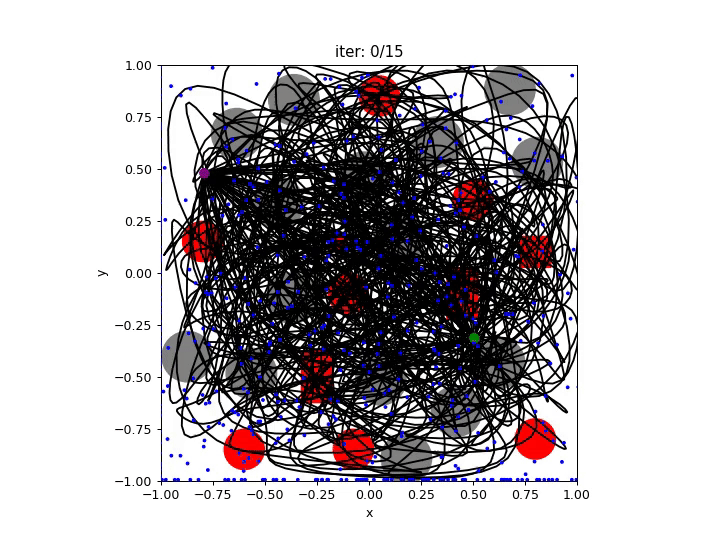
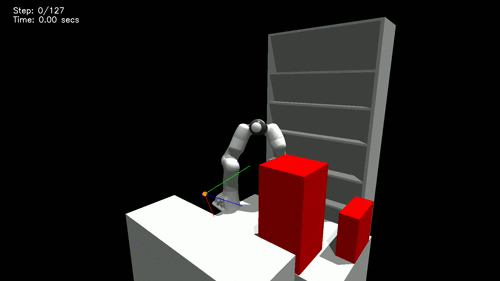

# Motion Planning Diffusion: 使用扩散模型学习和适配机器人运动规划

[](https://ieeexplore.ieee.org/abstract/document/11097366)
[](https://arxiv.org/abs/2412.19948)
[](https://sites.google.com/view/motionplanningdiffusion/)
[]()


<div style="display: flex; text-align:center; justify-content: center">
    
    
</div>

本仓库实现了 Motion Planning Diffusion (**MPD**) —— 一种利用扩散模型进行学习和规划机器人运动的方法。

该项目的一个旧版本已经弃用，但仍可在 [https://github.com/jacarvalho/mpd-public](https://github.com/jacarvalho/mpd-public) 获取。

如果您有任何问题，请联系我 —— [joao@robot-learning.de](mailto:joao@robot-learning.de)

---
# 安装

前置条件：
- Ubuntu 22.04（可能也适用于更高版本）
- [miniconda](https://docs.conda.io/projects/miniconda/en/latest/index.html)

克隆此仓库：
```bash
git clone --recurse-submodules https://github.com/ujd66/mpd-new.git
cd mpd-splines-public
```


运行 bash 设置脚本以安装所有内容（这可能需要一段时间）：
```bash
bash setup.sh
```

在运行任何脚本之前，请务必设置环境变量并激活 conda 环境：
```bash
source set_env_variables.sh
conda activate mpd-new
```

---
## 下载数据集和预训练模型

下载链接：https://drive.google.com/file/d/1KG5ejn0g0KkDuUK6tPUqfmRYCNoKzK4K/view?usp=drive_link

```bash
tar -xvf data_public.tar.gz
ln -s data_public/data_trajectories data_trajectories
ln -s data_public/data_trained_models data_trained_models
```

### Rizon10s 数据集和模型位置

本项目的资源组织在以下位置：

```
/media/bochu/文档/data_public/
├── data_trajectories/
│   └── EnvSpheres3D-RobotRizon10s-joint_joint-one-RRTConnect/
│       ├── dataset_merged.hdf5           # 原始合并数据 (~480K 轨迹)
│       ├── dataset_merged_doubled.hdf5   # 翻倍后数据 (~960K 轨迹)
│       └── args.yaml                     # 数据集元信息
└── data_trained_models/
    └── rizon10s_diffusion_500k/          # 训练好的模型目录
        ├── checkpoints/                  # 所有训练检查点
        │   ├── ema_model__iter_500000.pth
        │   └── model__iter_500000.pth
        ├── args.yaml                     # 训练参数
        └── train_subset_indices.pt       # 训练集索引
```


---
## 使用预训练模型进行推理

[scripts/inference/cfgs](scripts/inference/cfgs) 下的配置文件包含了推理的超参数。\
在 `scripts/inference/inference.py` 文件中，您可以更改 `cfg_inference_path` 参数来尝试针对不同环境训练的模型。

```bash
cd scripts/inference
python inference.py
python inference.py --planner_alg rrtconnect_then_guide --n_trajectory_samples 1

```
对比运行（同时记录日志）：

```bash
source set_env_variables.sh && conda activate mpd-new

python inference.py > mpd_results.log 2>&1 && \
python inference.py --planner_alg rrtconnect_then_guide --n_trajectory_samples 1 > hybrid_results.log 2>&1
```

---
# 训练先验模型（从头开始）


## 数据生成

生成数据需要很长时间，因此我们建议[下载数据集](#下载数据集和预训练模型)。
但如果您仍然想生成自己的数据，可以使用 `scripts/generate_data` 文件夹中的脚本。

前往 `scripts/generate_data` 文件夹。

基础脚本是：
```bash
python generate_trajectories.py
```

要并行生成多个数据集，请修改 `launch_generate_trajectories.py` 脚本：
```bash
python launch_generate_trajectories.py
```

生成数据后，运行后处理文件将所有数据合并到一个 hdf5 文件中。
然后，您可以通过翻转轨迹路径来使数据集翻倍。
```bash
python post_process_trajectories.py --help
python flip_solution_paths.py  (修改 PATH_TO_DATASETS 变量)
```

要可视化生成的数据，使用 `visualize_trajectories.py` 脚本：
```bash
python visualize_trajectories.py
```

---
## 训练模型

训练脚本位于 `scripts/train` 文件夹中。

基础脚本是：
```bash
cd scripts/train
python train.py
```

要并行训练多个模型，请使用 `launch_train_*` 文件。


---
## Rizon10s 实施流程 (Step-by-Step)

本节提供从零开始训练 Flexiv Rizon10s 机器人的完整操作指令。

### 1. 环境准备 (Environment Setup)

在开始任何操作前，请务必设置环境变量：

```bash
cd mpd-splines-public
source set_env_variables.sh
conda activate mpd-new
```

### 2. 数据生成 (Data Generation)

生成 100 万条原始轨迹数据。

```bash
# 并行生成轨迹 (预计 2-4 小时)
python scripts/generate_data/launch_rizon10s_million.py
```

### 3. 数据处理 (Data Processing)

对生成的数据进行合并、翻倍增强，并链接到标准目录。

```bash
# 1. 合并散落的数据批次
python scripts/generate_data/post_process_generated_dataset.py \
  --data_dir data/rizon/EnvSpheres3D-RobotRizon10s-joint_joint-one-RRTConnect

# 2. 翻转轨迹以使数据集翻倍
python scripts/generate_data/flip_solution_paths.py \
  --data_dir data/rizon/EnvSpheres3D-RobotRizon10s-joint_joint-one-RRTConnect

# 3. 创建数据链接 (指向 data_trajectories，将 <DATA_ROOT> 替换为实际路径)
ln -sf <DATA_ROOT>/data_public/data_trajectories/EnvSpheres3D-RobotRizon10s-joint_joint-one-RRTConnect data_trajectories/
```

### 4. 模型训练 (Model Training)

使用处理好的数据训练扩散模型。

```bash
cd scripts/train
python train.py \
  --dataset_subdir EnvSpheres3D-RobotRizon10s-joint_joint-one-RRTConnect \
  --dataset_file_merged dataset_merged_doubled.hdf5 \
  --debug False \
  --num_train_steps 500000 \
  --batch_size 256 \
  --steps_til_summary 10000 \
  --steps_til_ckpt 10000 \
  --wandb_mode online \
  --wandb_entity ren-qing-east-china-university-of-science-and-technology \
  --wandb_project rizon10s_mpd_training
```

> **存储建议**: 训练完成后，建议将模型移动到 `/media/bochu/文档/data_public/data_trained_models/`。

### 5. 推理验证 (Inference)

加载训练好的模型进行运动规划测试。

```bash
cd scripts/inference
# 确保 config_EnvSpheres3D-RobotRizon10s_00.yaml 中的 model_dir 指向了正确的模型路径
python inference.py \
  --cfg_inference_path ./cfgs/config_EnvSpheres3D-RobotRizon10s_00.yaml \
  --n_start_goal_states 10 \
  --render_pybullet True \
  --device cuda:0
```
---


---
## 鸣谢

本工作及软件的部分内容取自或启发自：
- [https://github.com/jannerm/diffuser](https://github.com/jannerm/diffuser)
